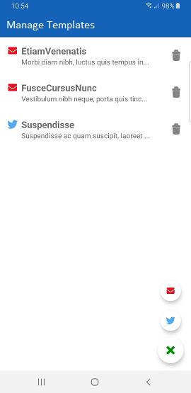

# Rep-Messenger
An Android application, utilizes Google's Civic Information API to display elected representatives in the user's zipcode. Rep Messenger simplifies civic engagement by saving generalized templates by the user which are then auto-customized and ready to send via tweet or email.

Screenshots
-----------

